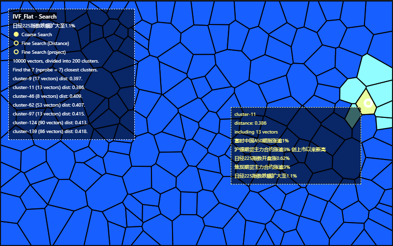
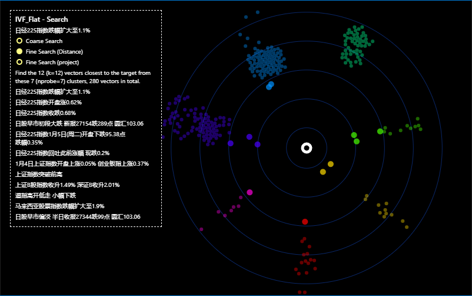
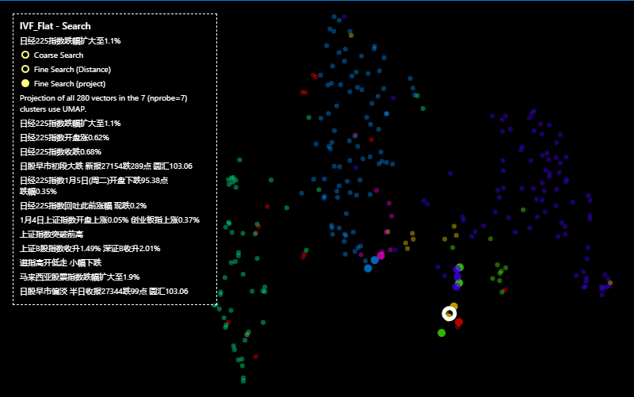

# jiajia_vis4embed
This is the visualization of embedding for news. We utilize [feder](https://github.com/zilliztech/feder) to visualize the news embeddings. The news are embedded by 3 methods, BERT, m3e and openai ada. The embeddings firstly are processed by [faiss](https://github.com/facebookresearch/faiss) and then visualized. As a by-product, we also tried to visualize the news embeddings processed by [hnswlib](https://github.com/nmslib/hnswlib).

## Dependency (only visualization part)
federpy 0.8.0

## Contents
├── embed_idx --> (Indices of the embeddings obtained by faiss/hnswlib with different embeddings methods)
├── feder.ipynb --> (Visualize a random vector of BERT/m3e/openai embeddings of news which are processed by faiss/hnswlib)
└── searchview_byID.ipynb --> (Visualize a random vector by vector ID)

For more information of search functions, you can read source codes of [federpy.py](https://github.com/zilliztech/feder/blob/main/federpy/src/federpy/federpy.py)

## Screenshots

